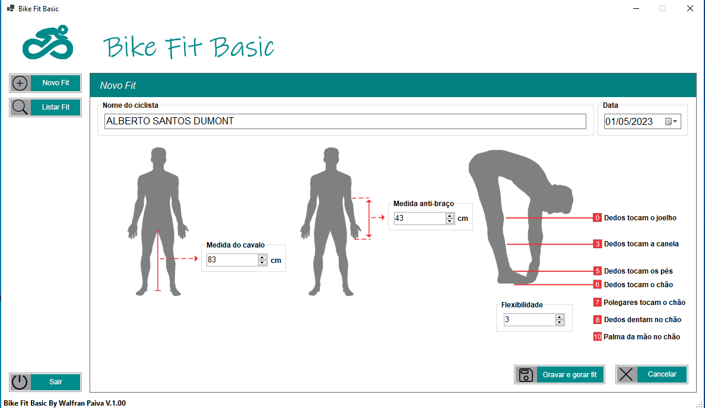
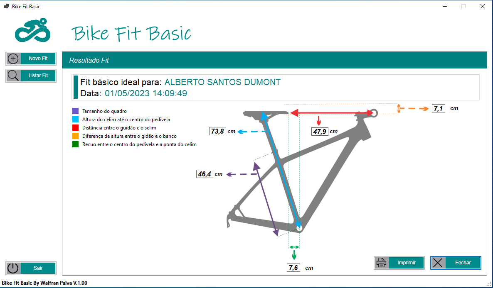
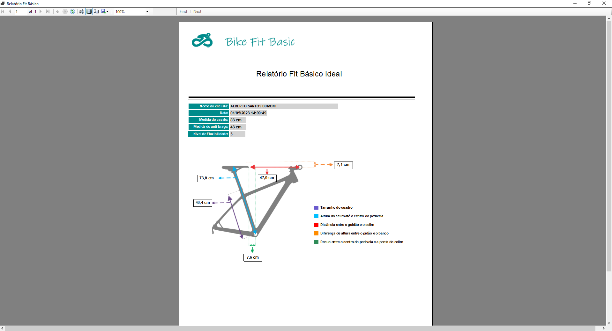
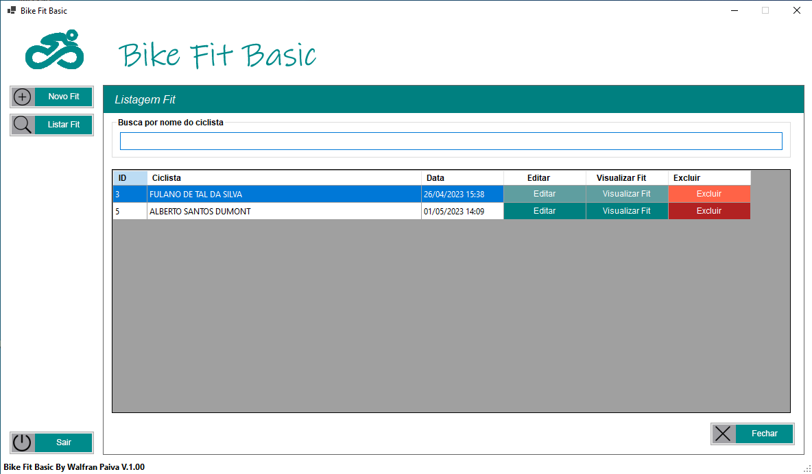

  

# C# - Software para bike fit básico.

## O que é este projeto?
O projeto tem como objetivo calcular as medidas básicas ideais para serem feitas na bike para evitar desconforto e lesões no ciclista.
(Como o próprio nome, o software calcula as medidas básicas ideais para o ciclista. Mas para realmente um maior conforto e maior precisão, é recomendado
a consulta em um profissional fiter para identificar as especificidades para cada ciclista.)

## Pré-requisitos
- Visual Studio
- .NET(core) 6
- EF core para sqlite
## Para rodar este projeto

Apenas abrir o vusual studio e carregar o projeto suas dependências e compila-lo. (Projeto com Etity Framework core).
